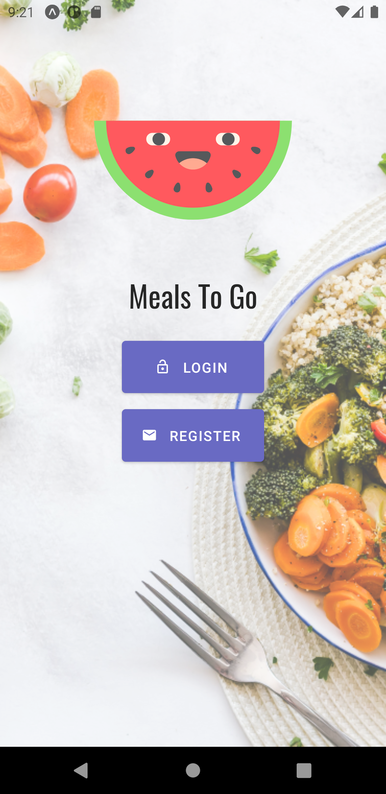

# MealsToGo

Hi!
MealsToGo a is food delivery app ,that I develop using react native,

for live demo using expo [click here](https://expo.io/@dank179/projects/MealsToGo)

sample user:
email - john@example.com
password - john147

## Built With

- [React-Native](https://reactnative.dev/) - React Native is an open-source mobile application framework created by Facebook.
- [Back4App](https://www.back4app.com/) - Back4app is a platform that uses Parse open source for migration alternative, it is a hub for backend where you can build, host and share APIs for web, mobile and IoT.
- [Parse-Server](https://parseplatform.org/) - Parse Server is an open source Backend-as-a-Service(BaaS) framework initially developed by Facebook.
- [MongoDB](https://www.mongodb.com/) - MongoDB is a source-available cross-platform document-oriented database program.
- [Redux](https://redux.js.org/) - Redux is an open-source JavaScript library for managing application state
